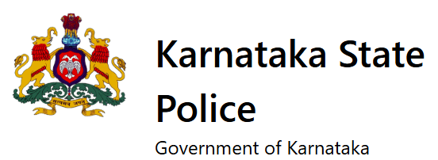
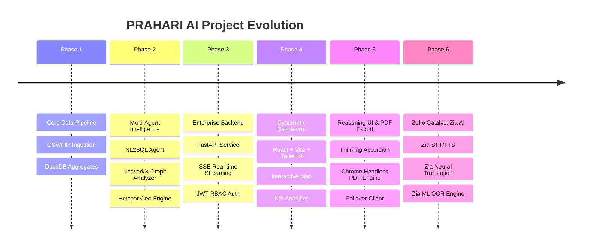

# PRAHARI AI
> **Proactive Response & Analytics Hub for Actionable Records & Investigation**  
> *AI-Powered Intelligence Copilot & Tactical Analytics Platform for Karnataka State Police*

<div align="center">
  <table>
    <tr>
      <td align="center" valign="middle" border="0">
        <br />
        <sub><b>Karnataka State Police</b></sub>
      </td>
      <td align="center" valign="middle" border="0">
        <br />
        <sub><b>PRAHARI AI</b></sub>
      </td>
      <td align="center" valign="middle" border="0">
        <br />
        <sub><b>Zoho</b></sub>
      </td>
      <td align="center" valign="middle" border="0">
        <br />
        <sub><b>Zoho Catalyst Platform</b></sub>
      </td>
    </tr>
  </table>
</div>

<br />

<div align="center">

[](https://python.org)
[](https://fastapi.tiangolo.com)
[](https://react.dev)
[](https://duckdb.org)
[](https://catalyst.zoho.com)
[](https://tailwindcss.com)
[](#)

</div>

---

## Datathon Context & Project Vision

**PRAHARI AI** was developed as part of the **Karnataka State Police Datathon / AI Intelligence Hackathon**, built to harness Cloud AI and Machine Learning to modernize state law enforcement workflows.

The system empowers police command staff, Station House Officers (SHOs), and intelligence officers across Karnataka to transform raw First Information Reports (FIRs) into actionable tactical intelligence through natural language database queries, real-time spatio-temporal analytics, offender network mapping, automated enterprise PDF generation, and Zoho Catalyst Zia Multimodal AI integration.

---

## Key Features & Specialities

### 1. Natural Language to SQL (NL2SQL) Engine
Translates natural language police queries (such as *"Which district had the most FIRs in 2022?"*) into optimized DuckDB queries across millions of FIR records with strict **Role-Based Access Control (RBAC)** to redact PII for lower clearance levels.

### 2. Collapsible Reasoning Model Thinking UI
Real-time extraction and rendering of internal LLM thought processes (`<think>` tags and `reasoning_content` deltas) inside collapsible accordions, providing officers full transparency into how AI reaches its analytical conclusions.

### 3. Zoho Catalyst Zia Multimodal Services Integration
Integrated **Zoho Catalyst Zia AI** services across the platform:
- **Zia Speech-to-Text (STT)**: Direct voice query input in **Kannada (`kn-IN`)** and **English (`en-IN`)**.
- **Zia Text-to-Speech (TTS)**: Voice playback of AI responses in native accent.
- **Zia Neural Translation**: Real-time bidirectional translation between Kannada and English.
- **Zia ML OCR Engine**: Optical Character Recognition API (`POST /baas/v1/project/{PROJECT_ID}/ml/ocr`) to scan uploaded evidence images, FIR sheets, and handwritten notes with live scanning overlay UI.

For complete step-by-step instructions on setting up Zoho Catalyst and enabling Zia services, refer to the [Zoho Catalyst Deployment Guide](prahari-ai-backend/docs/deployment.md).

### 4. Enterprise Chrome-Based PDF Report Generator
HTML-to-PDF printing engine powered by **Google Chrome Headless** and Jinja2 templates:
- **Cover Page**: Karnataka State Police emblem, Prahari AI branding, session ID, model, role, and confidentiality badge.
- **Watermarking**: Diagonal `CONFIDENTIAL` watermark at 4% opacity on every page.
- **Turn Cards**: Structured cards with dark Mac-style code blocks for SQL, syntax highlighting, callout summary boxes, and headers/footers.

### 5. Multi-Provider Fast Failover LLM Architecture
Features automatic failover across **NVIDIA API** (`nvidia/nemotron-3-super-120b`, `deepseek-ai/deepseek-v4-pro`, `meta/llama-3.3-70b-instruct`) and **Groq API** (`llama-3.3-70b-versatile`) with non-blocking read timeouts.

### 6. NetworkX Co-Accused Graph & Spatial Crime Map
Maps criminal connections, offender clusters, and degree centrality to identify repeat offender rings alongside interactive Leaflet heatmaps across Karnataka state coordinates.

---

## Project Evolution



---

## Technology Stack

| Domain | Technologies |
| :--- | :--- |
| **Cloud AI Services** | **Zoho Catalyst Zia Services** (STT, TTS, Neural Translation, ML OCR) |
| **LLM Orchestration** | NVIDIA API (Nemotron 3, DeepSeek v4 Pro), Groq API, OpenAI Python SDK |
| **Data Engine & ML** | Python 3.12, DuckDB, Pandas, NumPy, NetworkX, Jinja2, Chrome Headless |
| **Backend API** | FastAPI, SQLite (`prahari_auth.db`), OAuth2, JWT (`python-jose`), Passlib |
| **Frontend UI** | React 19, TypeScript, Vite, Tailwind CSS, Framer Motion, Leaflet, Lucide Icons |

---

## Quickstart & Setup Guide

### Prerequisites
- Python 3.12+
- Node.js 18+ and npm
- Google Chrome (for PDF export)

### 1. Environment Configuration
Set up environment variables in `prahari-ai-backend/.env` and `prahari-ai-ml/.env`:
```env
# NVIDIA & Groq APIs
NVIDIA_API_KEY=nvapi-your-nvidia-key
GROQ_API_KEY=gsk-your-groq-key

# Zoho Catalyst Credentials
CATALYST_PROJECT_ID=your-catalyst-project-id
CATALYST_ZIA_TOKEN=your-catalyst-token
```

### 2. Backend & ML Service
```bash
cd prahari-ai-backend
python -m venv venv
source venv/bin/activate  # Windows: venv\Scripts\activate
pip install -r requirements.txt
python -m uvicorn app.main:app --reload --port 8000
```

Detailed deployment instructions for Zoho Catalyst AppSail are available in [backend/docs/deployment.md](prahari-ai-backend/docs/deployment.md).

### 3. Frontend Dashboard
```bash
cd prahari-ai-frontend
npm install
npm run dev
```

---

## Project Collaborators

<table>
  <tr>
    <td align="center" width="200">
      <a href="https://github.com/Dharaneesh20">
        <br />
        <br />
        <sub><b>Dharaneesh R S</b></sub><br />
        <sub><code>@Dharaneesh20</code></sub><br />
        <br />
        <small>Lead Architect, Backend & ML Pipeline</small>
      </a>
    </td>
    <td align="center" width="200">
      <a href="https://github.com/aadithya2007">
        <br />
        <br />
        <sub><b>Aadithya</b></sub><br />
        <sub><code>@aadithya2007</code></sub><br />
        <br />
        <small>ML Pipeline & Data Analytics Engineer</small>
      </a>
    </td>
    <td align="center" width="200">
      <a href="https://github.com/anumitha21">
        <br />
        <br />
        <sub><b>Anumitha</b></sub><br />
        <sub><code>@anumitha21</code></sub><br />
        <br />
        <small>Data Engineering & Geospatial Analytics</small>
      </a>
    </td>
  </tr>
</table>

---

## License
*Copyright © 2026 PRAHARI AI Team. Confidential & Proprietary for Karnataka State Police Analytics.*
