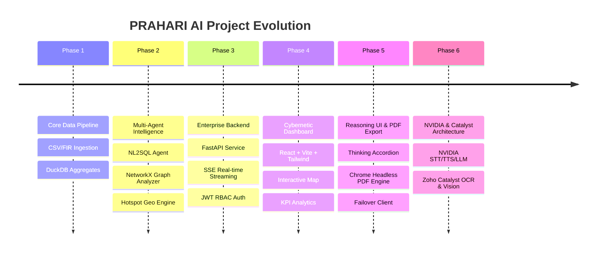

<div align="center">

# 🛡️ PRAHARI AI — Law Enforcement Multimodal AI Intelligence Platform

**Karnataka State Police Datathon — Production-Grade AI Refactor**

[](https://python.org)
[](https://fastapi.tiangolo.com)
[](https://react.dev)
[](https://duckdb.org)
[](https://build.nvidia.com)
[](https://catalyst.zoho.com)
[](https://tailwindcss.com)

</div>

---

## Datathon Context & Project Vision

**PRAHARI AI** was developed as part of the **Karnataka State Police Datathon / AI Intelligence Hackathon**, built to harness Cloud AI and Machine Learning to modernize state law enforcement workflows.

The system empowers police command staff, Station House Officers (SHOs), and intelligence officers across Karnataka to transform raw First Information Reports (FIRs) into actionable tactical intelligence through natural language database queries, real-time spatio-temporal analytics, offender network mapping, automated enterprise PDF generation, and high-accuracy multimodal AI service integrations via **NVIDIA AI Hosted APIs** and **Zoho Catalyst Microservices**.

---

## Key Features & Capabilities

### 1. Multimodal AI Integrations (NVIDIA AI & Zoho Catalyst)
The application architecture clearly decouples voice, speech, translation, and LLM services from vision and document intelligence:

- **NVIDIA AI Hosted APIs**:
  - **Speech Recognition (STT)**: High-accuracy multilingual speech-to-text in Kannada (`kn-IN`) and English (`en-IN`).
  - **Voice Synthesis (TTS)**: Natural voice generation using hosted inference endpoints.
  - **Neural Translation**: Real-time bidirectional translation between Kannada and English.
  - **LLM Chat & Summarization**: Conversational intelligence and automated FIR report summarization using hosted open-source models (Llama-3 / Mistral).

- **Zoho Catalyst Microservices**:
  - **Optical Character Recognition (OCR)**: Extracts printed text from FIR sheets, scanned evidence, and handwritten notes (`POST /api/v1/catalyst/ocr`).
  - **Text Analytics**: Entity extraction, sentiment analysis, and key phrase detection.
  - **Face Analytics**: Face detection and demographic attribute analysis.
  - **Object Recognition**: Identifies vehicles, weapons, and evidence items from images.
  - **Barcode Scanner**: Reads QR codes and barcodes.
  - **Identity Scanner**: Automated parsing of government identity cards (Aadhaar, Passport, DL).
  - **Image Moderation**: Detects explicit or unsafe image content.

### 2. Natural Language to SQL (NL2SQL) Engine
Translates natural language police queries (such as *"Which district had the most FIRs in 2022?"*) into optimized DuckDB queries across millions of FIR records with strict **Role-Based Access Control (RBAC)** to redact PII for lower clearance levels.

### 3. Collapsible Reasoning Model Thinking UI
Real-time extraction and rendering of internal LLM thought processes (`<think>` tags and `reasoning_content` deltas) inside collapsible accordions, providing officers full transparency into how AI reaches its analytical conclusions.

### 4. Enterprise Chrome-Based PDF Report Generator
HTML-to-PDF printing engine powered by **Google Chrome Headless** and Jinja2 templates:
- **Cover Page**: Karnataka State Police emblem, Prahari AI branding, session ID, model, role, and confidentiality badge.
- **Watermarking**: Diagonal `CONFIDENTIAL` watermark at 4% opacity on every page.
- **Turn Cards**: Structured cards with dark Mac-style code blocks for SQL, syntax highlighting, callout summary boxes, and headers/footers.

---

## Technical Architecture Evolution



---

## Technology Stack

| Domain | Technologies |
| :--- | :--- |
| **Speech, Voice & LLM AI** | **NVIDIA AI Hosted APIs** (Parakeet STT, FastPitch TTS, Llama-3 LLM, NLLB Translation) |
| **Document & Vision Microservices** | **Zoho Catalyst** (OCR, Text Analytics, Face Analytics, Object Recognition, Identity Scanner) |
| **Data Engine & ML** | Python 3.12, DuckDB, Pandas, NumPy, NetworkX, Jinja2, Chrome Headless |
| **Backend API** | FastAPI, SQLite (`prahari_auth.db`), OAuth2, JWT (`python-jose`), Passlib |
| **Frontend UI** | React 19, TypeScript, Vite, Tailwind CSS, Framer Motion, Leaflet, Lucide Icons |

---

## Quickstart & Setup Guide

### Prerequisites
- Python 3.12+
- Node.js 18+ and npm
- Google Chrome (for PDF export engine)

### 1. Environment Configuration
Set up environment variables in `prahari-ai-backend/.env`:

```env
# JWT Auth
SECRET_KEY=your-secret-key-change-in-production-min-32-chars
JWT_SECRET=your-jwt-secret-here

# Zoho Catalyst Credentials
CATALYST_PROJECT_ID=your-catalyst-project-id
CATALYST_CLIENT_ID=your-catalyst-client-id
CATALYST_CLIENT_SECRET=your-catalyst-client-secret
CATALYST_REFRESH_TOKEN=your-catalyst-refresh-token
CATALYST_DC=IN

# NVIDIA AI Hosted APIs
NVIDIA_API_KEY=nvapi-your-nvidia-api-key

# LLM (Groq Fallback)
GROQ_API_KEY=your-groq-api-key-here
```

### 2. Backend Service
```bash
cd prahari-ai-backend
python3 -m venv venv
source venv/bin/activate
pip install -r requirements.txt
python3 run.py
```

### 3. Frontend Client
```bash
cd prahari-ai-frontend
npm install
npm run dev
```

For complete step-by-step instructions on setting up Zoho Catalyst OAuth and NVIDIA AI keys, refer to the [Deployment Guide](prahari-ai-backend/docs/deployment.md).
