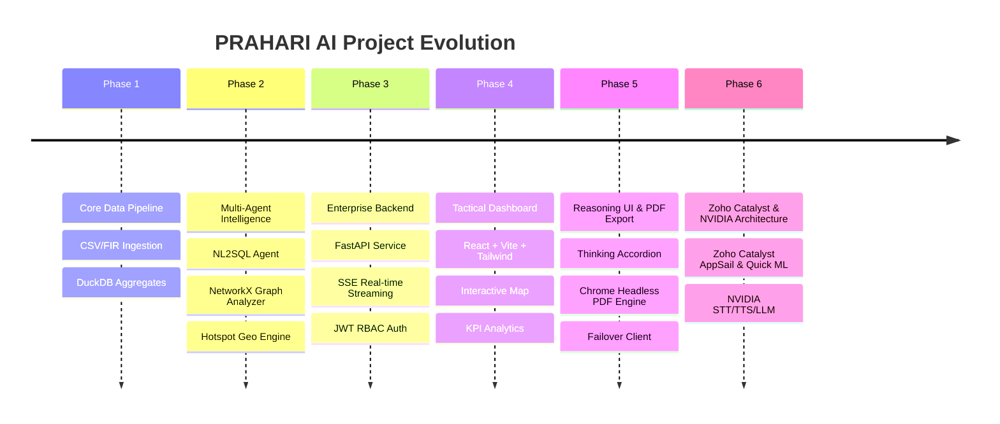

# PRAHARI AI
> **Proactive Response & Analytics Hub for Actionable Records & Investigation**  
> *AI-Powered Intelligence Copilot & Tactical Analytics Platform for Karnataka State Police*

<div align="center">
  <table>
    <tr>
      <td align="center" valign="middle" border="0">
        <br />
        <sub><b>Karnataka State Police</b></sub>
      </td>
      <td align="center" valign="middle" border="0">
        <br />
        <sub><b>PRAHARI AI</b></sub>
      </td>
      <td align="center" valign="middle" border="0">
        <br />
        <sub><b>Zoho</b></sub>
      </td>
      <td align="center" valign="middle" border="0">
        <br />
        <sub><b>Zoho Catalyst Platform</b></sub>
      </td>
    </tr>
  </table>

  <br />

  [](https://prahari-ai-demo.catalystappsail.com)
  [](https://python.org)
  [](https://fastapi.tiangolo.com)
  [](https://react.dev)
  [](https://catalyst.zoho.com)
  [](https://build.nvidia.com)
</div>

---

## Executive Overview

**PRAHARI AI** (Proactive Response & Analytics Hub for Actionable Records & Investigation) is a production-grade multimodal AI command and tactical analytics platform engineered for state law enforcement. Developed for the **Karnataka State Police Datathon**, the platform empowers police command staff, Station House Officers (SHOs), and intelligence analysts to transform raw First Information Reports (FIRs), spatio-temporal incident logs, and evidence streams into actionable tactical intelligence.

### Live Application Endpoint
- **Live Demo Instance**: [https://prahari-ai-demo.catalystappsail.com](https://prahari-ai-demo.catalystappsail.com)
- **Deployment Platform**: **Zoho Catalyst AppSail** (Application Container Hosting) & **Zoho Catalyst Quick ML** (Machine Learning Microservices)

---

## Decoupled Cloud AI & Microservice Architecture

The platform architecture strictly decouples document, vision, and identity microservices (**Zoho Catalyst Cloud Services**) from speech, translation, and large language model inference (**NVIDIA AI Hosted APIs**):

```
+-------------------------------------------------------------------------------+
|                                  PRAHARI AI                                   |
|                  Frontend Client: React 19 + Vite + TypeScript                |
+---------------------------------------+---------------------------------------+
                                        |
                                        v
+-------------------------------------------------------------------------------+
|                       Backend API: FastAPI (Python 3.12)                      |
|                  Authentication: OAuth2 + JWT (prahari_auth.db)                |
+-----------------------------------+-------------------------------------------+
                                    |
            +-----------------------+-----------------------+
            |                                               |
            v                                               v
+---------------------------------------+ +-------------------------------------+
|        ZOHO CATALYST SERVICES         | |          NVIDIA AI APIS             |
|  (Hosted via AppSail & Quick ML)      | |      (Hosted API Endpoints)         |
+---------------------------------------+ +-------------------------------------+
| • Quick ML Optical Character Rec.     | | • Speech-to-Text (Parakeet ASR)     |
| • Quick ML Vision & Object Detection  | | • Text-to-Speech (FastPitch TTS)    |
| • Quick ML Face Recognition           | | • Neural Translation (KN <-> EN)    |
| • Quick ML Text Analytics             | | • LLM Inference (Llama-3 / Mistral) |
| • Quick ML Identity Scanner           | +-------------------------------------+
| • Quick ML Image Moderation           |
| • Quick ML Barcode & QR Scanner       |
+---------------------------------------+
```

---

## Key Functional Capabilities

### 1. Zoho Catalyst Microservices Integration (Quick ML & AppSail)
- **Zoho Catalyst AppSail**: Scalable container hosting and execution lifecycle management for the PRAHARI full-stack application.
- **Zoho Catalyst Quick ML — Optical Character Recognition (OCR)**: Scans printed text from evidence documents, handwritten field notes, and official FIR forms (`POST /api/v1/catalyst/ocr`).
- **Zoho Catalyst Quick ML — Vision AI & Object Detection**: Identifies vehicles, weapons, and evidence items from crime scene imagery (`POST /api/v1/catalyst/object-detection`).
- **Zoho Catalyst Quick ML — Face Analytics**: Detects faces, facial landmarks, and demographic attributes (`POST /api/v1/catalyst/face-analytics`).
- **Zoho Catalyst Quick ML — Text Analytics**: Performs entity extraction, sentiment analysis, and key phrase detection on crime narratives (`POST /api/v1/catalyst/text-analytics`).
- **Zoho Catalyst Quick ML — Identity Scanner**: Automated verification and parsing of government identity documents (`POST /api/v1/catalyst/identity-scanner`).
- **Zoho Catalyst Quick ML — Image Moderation**: Automated safety screening for explicit content (`POST /api/v1/catalyst/image-moderation`).
- **Zoho Catalyst Quick ML — Barcode Scanner**: Decodes barcodes and QR tags on physical evidence bags (`POST /api/v1/catalyst/barcode-scanner`).

### 2. NVIDIA AI Hosted APIs Integration
- **Speech Recognition (STT)**: High-accuracy automatic speech recognition supporting English (`en-IN`) and Kannada (`kn-IN`) (`POST /api/v1/ai/stt`).
- **Voice Synthesis (TTS)**: High-fidelity speech synthesis for reading investigation briefs aloud (`POST /api/v1/ai/tts`).
- **Neural Translation**: Bidirectional translation between Kannada and English (`POST /api/v1/ai/translate`).
- **LLM Chat & Summarization**: Conversational intelligence and automated FIR report summarization using hosted Llama-3 / Mistral endpoints (`POST /api/v1/ai/chat`, `POST /api/v1/ai/summarize`).

### 3. Natural Language to SQL (NL2SQL) Query Engine
Translates natural language police queries (such as *"Which police station registered the highest number of cyber crime FIRs in 2023?"*) into optimized DuckDB analytical queries across millions of FIR records. Integrated with strict **Role-Based Access Control (RBAC)** to redact Personally Identifiable Information (PII) for lower clearance levels.

### 4. Collapsible Reasoning Model Thinking UI
Real-time extraction and streaming of internal LLM thought processes (`<think>` tags and `reasoning_content` deltas) inside collapsible UI accordions, providing officers with full transparency into how the AI constructs its tactical recommendations.

### 5. Enterprise Chrome-Based PDF Report Generator
HTML-to-PDF document generation engine powered by **Google Chrome Headless** and Jinja2 templates:
- **Cover Header**: Official Karnataka State Police emblem, PRAHARI AI branding, session ID, user role, and confidentiality badge.
- **Security Watermarking**: Diagonal `CONFIDENTIAL` watermark applied at 4% opacity on every page.
- **Structured Sections**: Dark Mac-style code blocks for SQL queries, syntax highlighting, callout summary boxes, and automated page footers.

### 6. NetworkX Co-Accused Syndicate Graph & Spatial Mapping
Analyzes co-accused criminal relationships, syndicate clusters, and degree centrality to expose organized crime networks, alongside interactive spatial heatmaps across Karnataka coordinates.

---

## Technical Architecture Evolution



---

## Technology Stack

| Domain | Technologies |
| :--- | :--- |
| **Cloud Hosting Platform** | **Zoho Catalyst AppSail** |
| **Machine Learning Microservices** | **Zoho Catalyst Quick ML** (OCR, Vision, Face, Text Analytics, Identity) |
| **Speech, Voice & LLM AI** | **NVIDIA AI Hosted APIs** (Parakeet STT, FastPitch TTS, Llama-3 LLM, NLLB Translation) |
| **Data Engine & ML** | Python 3.12, DuckDB, Pandas, NumPy, NetworkX, Jinja2, Chrome Headless |
| **Backend API Service** | FastAPI, SQLite (`prahari_auth.db`), OAuth2, JWT (`python-jose`), Passlib |
| **Frontend UI Client** | React 19, TypeScript, Vite, Tailwind CSS, Framer Motion, Leaflet, Lucide Icons |

---

## Environment & Setup Guide

### Prerequisites
- Python 3.12+
- Node.js 18+ and npm
- Google Chrome (required for PDF report generation)

### 1. Environment Configuration
Configure environment variables in `prahari-ai-backend/.env`:

```env
# Server Settings
HOST=0.0.0.0
PORT=8000

# Security & JWT Authentication
SECRET_KEY=your-production-jwt-secret-min-32-characters
JWT_SECRET=your-jwt-secret-key

# Zoho Catalyst Credentials
CATALYST_PROJECT_ID=your-catalyst-project-id
CATALYST_CLIENT_ID=your-catalyst-client-id
CATALYST_CLIENT_SECRET=your-catalyst-client-secret
CATALYST_REFRESH_TOKEN=your-catalyst-refresh-token
CATALYST_DC=IN

# NVIDIA AI Hosted APIs
NVIDIA_API_KEY=nvapi-your-nvidia-api-key
```

### 2. Backend Installation & Launch
```bash
cd prahari-ai-backend
python3 -m venv venv
source venv/bin/activate
pip install -r requirements.txt
python3 -m uvicorn app.main:app --host 0.0.0.0 --port 8000
```

### 3. Frontend Installation & Launch
```bash
cd prahari-ai-frontend
npm install
npm run dev
```

For complete step-by-step instructions on setting up Zoho Catalyst OAuth credentials and AppSail deployment, refer to the [Deployment Guide](prahari-ai-backend/docs/deployment.md).

---

## Organizational Credits & Acknowledgements

We acknowledge and credit the following organizations whose platforms, emblems, and APIs power the PRAHARI AI application:

- **Karnataka State Police**: For domain context, organizational structure, operational guidelines, and police station data modeling.
- **Zoho Catalyst**: For cloud infrastructure, application container hosting via **AppSail**, and machine learning microservices via **Quick ML**.
- **NVIDIA AI**: For hosted AI endpoints powering Speech-to-Text (STT), Text-to-Speech (TTS), Neural Translation, and LLM inference engines.

---

*PRAHARI AI — Proactive Response & Analytics Hub for Actionable Records & Investigation*
