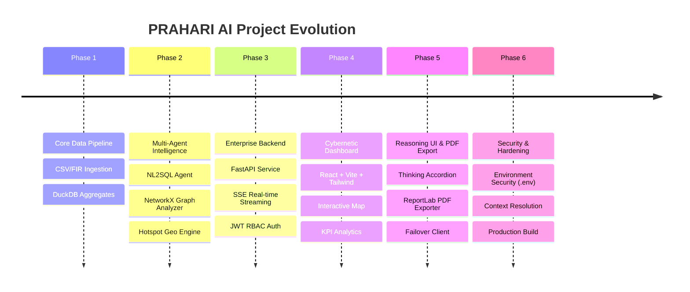

# 🚨 PRAHARI AI
> **Proactive Response & Analytics Hub for Actionable Records & Investigation**
> *AI-Powered Intelligence Copilot & Tactical Analytics Platform for Karnataka State Police*

[](https://python.org)
[](https://fastapi.tiangolo.com)
[](https://react.dev)
[](https://duckdb.org)
[](https://tailwindcss.com)
[](#)

---

## 🌟 What is PRAHARI AI & Speciality of the Project

**PRAHARI AI** (**P**roactive **R**esponse & **A**nalytics **H**ub for **A**ctionable **R**ecords & **I**nvestigation) is a state-of-the-art Law Enforcement Intelligence & Decision-Support System engineered for police command staff, station house officers (SHOs), and data analysts across Karnataka State Police (KSP). It transforms raw First Information Reports (FIRs) into actionable tactical intelligence through natural language database queries, real-time spatio-temporal analytics, offender network mapping, and automated report generation.

### ✨ Key Specialities & Standout Features

1. 🧠 **Reasoning Model Thinking UI**: Real-time extraction and visualization of internal LLM thought processes (`<think>` tags & `reasoning_content` deltas) inside collapsible accordions (minimized by default), giving officers full transparency into how AI reaches its analytical conclusions.
2. ⚡ **Natural Language to SQL (NL2SQL) Engine**: Translates natural language police queries (e.g., *"How many house theft cases in Whitefield?"*) into optimized DuckDB queries across millions of FIR records with strict **Role-Based Access Control (RBAC)** to redact PII for lower clearance levels.
3. 🔄 **Multi-Provider Fast Failover Pipeline**: Features zero-delay failover across **NVIDIA API** (`nvidia/nemotron-3-super-120b`, `deepseek-ai/deepseek-v4-pro`, `meta/llama-3.3-70b-instruct`) and **Groq API** (`llama-3.3-70b-versatile`) with non-blocking read timeouts for deep reasoning.
4. 🕸️ **NetworkX Co-Accused Graph Engine**: Maps criminal connections, offender clusters, and degree centrality to identify repeat offender rings and syndicate hubs.
5. 📄 **ReportLab PDF Exporter**: Instant single-click generation of official law enforcement conversation audit reports containing execution metadata, SQL code blocks, findings, and running page footers.
6. 🎨 **Cybernetic Command Dashboard**: Ultra-modern glassmorphism UI featuring interactive Leaflet crime maps, morphing canvas AI avatars (`LiquidOrb`), KPI analytics, and live incident monitoring.

---

## 📅 Development Progress (From Start to Present)



- **Phase 1: Foundation & Data Pipeline**: Ingested and cleansed state-wide FIR records, standardizing crime classifications, police unit metadata, and building aggregated DuckDB analytics tables (`fact_crime_agg`, `fact_crime_geo`).
- **Phase 2: Multi-Agent Intelligence Architecture**: Developed specialized agents for natural language SQL generation (`step5_nl2sql_agent.py`), criminal network analysis (`graph_agent.py`), and forecasting (`step6_trend_forecast.py`).
- **Phase 3: High-Performance FastAPI Backend**: Built an asynchronous FastAPI REST API (`prahari-ai-backend`) with SQLite authentication (`prahari_auth.db`), DuckDB singleton management, and Server-Sent Events (SSE) streaming (`/api/v1/search/nl2sql/stream`).
- **Phase 4: Futuristic Command Dashboard**: Built a responsive frontend (`prahari-ai-frontend`) with dark glassmorphic aesthetics, animated canvas avatars, real-time KPI metrics, and map visualization.
- **Phase 5: Reasoning Stream & Audit Exporter**: Integrated DeepSeek/Nemotron reasoning stream visualization (`<ThinkingBlock />`), fast failover configuration, and ReportLab PDF conversation export.
- **Phase 6: Production Hardening & Security**: Removed all inline API keys, moved credentials to `.env` files, added conversation context resolution for implicit location references (e.g. *"any theft cases there"*), and enforced mandatory SQL aggregations to eliminate statistical approximations.

---

## 👥 Collaborators & Contributors

We are proud to acknowledge the team behind the design, architecture, machine learning models, and engineering of PRAHARI AI:

| Collaborator | Role & Contributions | GitHub Profile |
| :--- | :--- | :--- |
| **Dharaneesh R S** | Lead Architect, Backend & ML Pipeline Developer | [](https://github.com/Dharaneesh20) |
| **Aadithya** | Machine Learning Pipeline & Data Analytics Engineer | [](https://github.com/aadithya2007) |
| **Anumitha** | Data Engineering & Geospatial Analytics Contributor | [](https://github.com/anumitha5831) |

---

## 🛠️ Technology Stack

### **Machine Learning & Pipeline**
- **Language**: Python 3.12
- **Database**: DuckDB (In-memory columnar SQL database)
- **Graph Analytics**: NetworkX, Pandas, NumPy
- **LLM Integrations**: NVIDIA API (Nemotron 3, DeepSeek v4 Pro), Groq API, OpenAI SDK, HTTPX
- **Document Generation**: ReportLab PDF Engine

### **Backend API Service**
- **Framework**: FastAPI (Asynchronous Python REST framework)
- **Auth & Security**: OAuth2 with Password Hashing (Passlib / bcrypt) & JWT Tokens (python-jose)
- **Database**: SQLite (`prahari_auth.db`) for user management & DuckDB singleton manager

### **Frontend Dashboard**
- **Framework**: React 19 + TypeScript + Vite
- **Styling**: Tailwind CSS + Custom Specular Glassmorphism CSS
- **Animations & Graphics**: Framer Motion, HTML5 Canvas API
- **Map Engine**: Leaflet / React-Leaflet
- **Markdown & Code**: ReactMarkdown, RemarkGFM, Lucide React Icons

---

## 🚀 Quickstart & Installation Guide

### Prerequisites
- Python 3.12+
- Node.js 18+ & npm
- Git

### 1. Environment Setup
Create a `.env` file inside `prahari-ai-ml/` and `prahari-ai-backend/`:
```env
NVIDIA_API_KEY=your_nvidia_api_key_here
GROQ_API_KEY=your_groq_api_key_here
SECRET_KEY=your_jwt_secret_key
```

### 2. Backend & ML Setup
```bash
cd prahari-ai-backend
python -m venv venv
source venv/bin/activate  # On Windows: venv\Scripts\activate
pip install -r requirements.txt
python -m uvicorn app.main:app --reload --port 8000
```

### 3. Frontend Setup
```bash
cd prahari-ai-frontend
npm install
npm run dev
```
Open `http://localhost:5173` in your browser.

---

## 📜 License
*Copyright © 2026 PRAHARI AI Team. Confidential & Proprietary for Karnataka State Police Analytics.*
