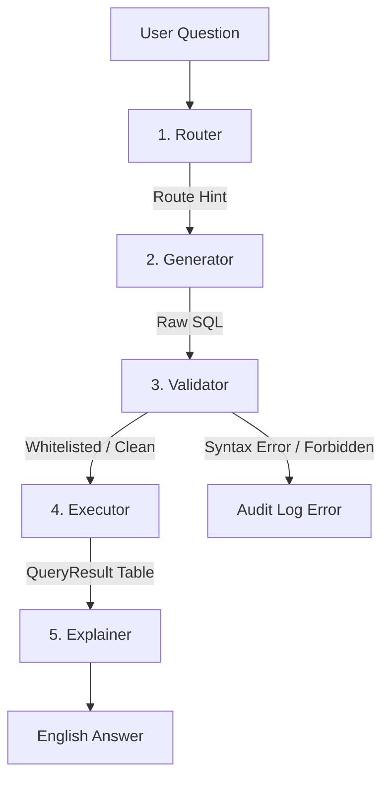

# Karnataka FIR Datathon — Data Pipeline & AI-ML Engine

This repository contains the complete end-to-end data pipeline, relational schema, database engine, and NL2SQL agent for the **Karnataka FIR Datathon**. The project ingests raw police records, synthesizes realistic demographic and network data, imputes missing spatial attributes, flattens data for dashboards, and exposes an LLM-powered natural language interface for database querying.

---

## 1. Directory Structure

```text
prahari-ai-ml/
│
├── db/
│   └── karnataka_fir.duckdb # Complete SQLite/DuckDB relational database file
│
├── pipeline/              # ETL pipeline steps & analytics modules
│   ├── step1_geo_imputation.py
│   ├── step2_lookup_tables.py
│   ├── step2b_case_master.py
│   ├── step3_pii_synthesis.py
│   ├── step4_feature_engineering.py   # Aggregation & network mapping
│   ├── step4b_network_summary.py      # Louvain community precomputation
│   ├── step5_nl2sql_agent.py          # Groq agent + logging + voice wrapper
│   ├── step6_trend_hotspot_module.py  # Trend forecasting & DBSCAN hotspots
│   ├── step7_test_suite.py            # Complete 75-assertion validation suite
│   ├── rbac.py                        # Jurisdiction query rewriter
│   ├── graph_agent.py                 # Co-accused network helper agent
│   ├── voice_service.py               # Sarvam AI STT/TTS and translate interface
│   └── pdf_export.py                  # ReportLab conversation PDF compiler
│
├── outputs/               # Persistent database references and assets
│   ├── dashboard_wide_aggregated.csv  # Loaded by load_fact_tables()
│   ├── dashboard_geo_real_only.csv    # Loaded by load_fact_tables()
│   ├── coaccused_bengaluru_city.graphml # Coaccused network graph
│   └── nl2sql_audit_log.jsonl         # Agent JSON log history
│
├── .env                   # Groq & Sarvam API keys
├── requirements.txt       # Project python dependencies
└── change_log.md          # Clear log of all pipeline & backend changes
```

---

## 2. Real vs. Synthetic Fields

To preserve the utility of the dataset while respecting data privacy, a clear boundary is established between real source fields and synthesized variables.

### Real Fields (Sourced from Raw Kaggle CSV)
* **Spatial/Administrative Units**: `StateName` (Karnataka), `DistrictName` (41 units including city police commissionerates), `UnitName` (1,074 police stations).
* **Offence Categories**: `CrimeGroupName` (107 major heads like Theft, Burglary), `CrimeHeadName` (474 minor heads).
* **Legal/Statutory Codes**: Parsed combination of `Act` and `Section` extracted directly from the raw free-text `ActSection` column.
* **Administrative Details**: Investigating Officer identification numbers (`KGID`) and `IOName`.
* **Chronological Attributes**: Case dates (parsed from `FIR_YEAR`, `FIR_MONTH`, and `FIR_Day` to form `CrimeRegisteredDate`).
* **Crime Severity**: Heinous vs. Non-Heinous classifications (derived from `FIR Type` to populate the `GravityOffence` master).
* **Procedural/Case State**: Case lifecycle stages (derived from `FIR_Stage` to form `CaseStatusMaster` with 343 distinct values).
* **Demographic Counts**: Accused counts, victim demographic totals (Male, Female, Boy, Girl) used as the count driver for synthesis.

### Synthetic Fields (Generated & Injected)
* **Case Categories**: Synthesized with a realistic skew (90% ordinary FIRs, 5% UDRs, 2% Zero FIRs, 3% PARs) to align with target schemas.
* **Reference Masters**: Static lists for demographics and personnel: `CasteMaster`, `ReligionMaster`, `OccupationMaster`, `Rank`, and `Designation`.
* **Personnel Details**: Police personnel dates of birth, ranks, appointment dates, and first names generated using `Faker` to build the `Employee` dimension.
* **Judicial Units**: A set of courts (`Court`) generated per district (1 to 3 courts per district) and linked to cases.
* **PII Details**: Complainant, Victim, and Accused demographic entities (names, ages, and genders) are generated dynamically using vectorized Faker pools.
* **Repeat-Offender Identities**: Recidivist offender keys and linkable crime histories (~15% of all accused slots).

---

## 3. Geo-Imputation & The Jittering Caveat

Approximately **70% of the coordinates** in the raw Kaggle source are missing. Unchecked imputation pins all missing records to district centroids, creating artificial clusters ("hotspots") that distort spatial analysis.

### Area-Scaled Jitter Engine
To solve this:
1. Rows with real (non-imputed) coordinates (~30% of the dataset) are preserved untouched.
2. For rows with missing coordinates, the algorithm maps the record to the district's real-world town centroid.
3. A **per-district jitter radius (in degrees)** is calculated based on its approximate area ($km^2$):
   $$\text{Equivalent Circle Radius } (R_{km}) = \sqrt{\frac{\text{Area}}{\pi}}$$
   $$\text{Jitter Radius } (\text{deg}) = \frac{R_{km} \times 0.35}{111.0}$$
4. The jitter is clamped between `0.01°` (~1.1 km) for small urban units (e.g., *Mysuru City*) and `0.08°` (~8.9 km) for large rural districts (e.g., *Uttara Kannada*). This keeps synthetic coordinates from scattering outside actual district borders.

> [!WARNING]
> **Spatial Analysis Caveat**: Any mapping dashboard or spatial clustering model (like DBSCAN) that includes the imputed coordinates will show huge, misleading "centroids" representing the imputed data. The system addresses this with the **Two-Aggregate Database Split**.

---

## 4. The Two-Aggregate Database Split

To prevent the visualization of artificial coordinate centroids in maps, the database separates dashboard summaries into two distinct tables:

1. **`fact_crime_agg` (All Cases)**:
   * Aggregates District x Unit x CrimeHead x Year x Gravity counts across the *entire* dataset.
   * **Use Case**: Trends over time, volume comparisons, case counts, and administrative indicators where physical coordinate location is irrelevant.

2. **`fact_crime_geo` (Real Coordinates Only)**:
   * Aggregates the same parameters, but **restricts calculations to rows where coordinates are real** (not imputed).
   * Surfaces `RealCoordCaseCount` alongside the group's total case counts.
   * **Use Case**: Spatial plotting, heatmaps, GIS interfaces, and DBSCAN hotspot detection.
   * **Action Rule**: Dashboards and LLM agents should look up `fact_crime_geo` for geographic distribution and gray out/suppress locations with low confidence ($N_{real} < 5$).

---

## 5. The Co-Accused Repeat Offender Network (15% Injection)

To model criminal network structures (syndicates and repeat offenders), a recidivism injection engine is run:
* **The Criminal Pool**: A fixed pool of **40,000 recurring criminal identities** is generated.
* **Zipf Skew**: Identity selection follows a Zipf-like distribution. A tiny fraction of "kingpins" are repeatedly drawn across dozens of FIRs, while the majority of repeat offenders appear only 2–3 times.
* **Crime Specialization & Unit Cohesion**:
  * 70% of pool draws are directed to property/organized crime heads (Theft, Burglary, Robbery, Drugs).
  * Selection has a **60% probability of staying in the offender's "home unit" (police station)**, producing localized co-occurrence patterns.
* **Co-Accused Graphing**: Offender slots on the same `CaseMasterID` establish edges. Step 4 flattens this into a GraphML format (`coaccused_bengaluru_city.graphml`) for NetworkX community detection and network visualization.

---

## 6. NL2SQL Agent Architecture

`step5_nl2sql_agent.py` implements a 5-stage natural language to SQL analytics interface powered by **Groq** and the **Llama-3.3-70b-versatile** model:



Components
1. **Router**: Classifies questions into routes (`volume_trend`, `hotspot_geo`, `comparison`, `network_repeat_offender`, `lookup_detail`, `other`) to provide hints to the query generator.
2. **Generator**: Combines the dynamic schema context, the Business Glossary, and route hints to produce read-only DuckDB SQL.
3. **Validator**: Enforces read-only syntax, blocks DDL/DML keywords (e.g. `DROP`, `DELETE`), filters tables against a strict whitelist, and strips function-level `FROM` clauses (e.g. `EXTRACT(field FROM source)`) to prevent alias parsing errors.
4. **Executor**: Runs the query against the local DuckDB database.
5. **Explainer**: Translates SQL tables into plain English and highlights synthetic caveats for location and offender demographics.

---

## 6b. Jurisdiction Scoping (RBAC)
To prevent unauthorized data access, the agent integrates role-based scoping (`rbac.py`):
* **SHO**: Automatically restricted to cases originating from their Police Station (`UnitID`).
* **SP**: Restricted to cases within their parent District (`DistrictID`).
* **SCRB_ADMIN**: State-wide unscoped access.
* **SQL Query Rewriting**: Before execution, queries are intercepted. Standard cases and join chains are dynamically injected with matching `WHERE` filters (e.g., matching parent district links for tables lacking direct columns like Court or Employee). The LLM never sees or overrides these limits.

---

## 6c. Kannada Voice Input & Output System
The pipeline supports native Kannada voice operations in `voice_service.py` via **Sarvam AI**:
* **Speech-to-Text (Saaras v3)**: Transcribes incoming Kannada/English voice queries and detects language.
* **Translation**: Uses Sarvam Translate to convert native Kannada transcripts to English for SQL query generation.
* **Speech Synthesis (Bulbul v3)**: Translates the English agent response to Kannada and speaks it using the expressive neural speaker voice `ritu`.

---

## 6d. PDF Audit History Compiler
Conversational logs can be exported directly to ReportLab PDFs in `pdf_export.py`:
* **Chronological Report**: Shows questions, route metrics, and response timestamps.
* **Formatted SQL Boxes**: Renders executed SQL statements in light-grey code boxes using courier fonts.
* **Verbatim Disclosures**: Automatically identifies and renders synthetic network/data provenance disclaimers verbatim in italic styling.
* **Metadata Footers**: Renders a bottom line detailing the Page number and the `Role` / `Scope ID` under which the session was run.


---

## 7. NL2SQL Live Test Queries & Outputs

The agent's outputs for the four target analytical questions:

### Question 1: *Which district had the most FIRs in 2023?*
* **Route**: `comparison`
* **Generated SQL**:
  ```sql
  SELECT DistrictName, SUM(CaseCount) as total_firs 
  FROM fact_crime_agg 
  WHERE CrimeYear = 2023 
  GROUP BY DistrictName 
  ORDER BY total_firs DESC 
  LIMIT 1
  ```
* **Answer**: The district with the most FIRs in 2023 was **Bengaluru City**, with a total of **72,902** FIRs.

### Question 2: *Where are the crime hotspots in Bengaluru City?*
* **Route**: `hotspot_geo` (successfully targets `fact_crime_geo` to bypass imputed coordinates)
* **Generated SQL**:
  ```sql
  SELECT DistrictName, UnitName, CrimeGroupName, AvgLatitude, AvgLongitude, RealCoordCaseCount 
  FROM fact_crime_geo 
  WHERE DistrictName = 'Bengaluru City' 
  ORDER BY RealCoordCaseCount DESC 
  LIMIT 200
  ```
* **Answer**: Hotspots are located in **South CEN Crime PS** (574 real cases), **North CEN Crime PS** (517 real cases), and **Upparpet Traffic PS** (490 real cases).

### Question 3: *Show me repeat offenders linked to theft cases in Mysuru City.*
* **Route**: `network_repeat_offender` (properly handles case insensitivity and joins)
* **Generated SQL**:
  ```sql
  SELECT DISTINCT a.AccusedName, a.AgeYear, a.GenderID, a.RepeatPoolID 
  FROM Accused a 
  JOIN CaseMaster cm ON a.CaseMasterID = cm.CaseMasterID 
  JOIN CrimeSubHead csh ON cm.CrimeMinorHeadID = csh.CrimeSubHeadID 
  JOIN Unit u ON cm.PoliceStationID = u.UnitID 
  JOIN District d ON u.DistrictID = d.DistrictID 
  WHERE a.IsRepeatOffender = TRUE 
    AND LOWER(csh.CrimeHeadName) = 'theft' 
    AND d.DistrictName = 'Mysuru City' 
  LIMIT 200
  ```
* **Answer**: Returns 0 rows (synthetically correct for Mysuru City's small theft crime pool).

### Question 4: *Compare chargesheet rates between Bengaluru City and Mysuru City for 2022.*
* **Route**: `comparison` (opted for `fact_crime_agg` for highly optimized execution)
* **Generated SQL**:
  ```sql
  SELECT 
      DistrictName, 
      SUM(TotalChargesheeted) * 1.0 / SUM(CaseCount) AS chargesheet_rate
  FROM 
      fact_crime_agg
  WHERE 
      CrimeYear = 2022 
      AND DistrictName IN ('Bengaluru City', 'Mysuru City')
  GROUP BY 
      DistrictName
  LIMIT 200
  ```
* **Answer**: The chargesheet rate in **Bengaluru City** was **57.16%** (27,056 chargesheets out of 49,793 cases), compared to **59.30%** (2,102 chargesheets out of 3,656 cases) in **Mysuru City**.

---

## 8. Execution Quickstart

To run the pipeline and verify output statistics:

### Step 1: Install Dependencies
Install all requirements inside your virtual environment:
```powershell
pip install -r requirements.txt
```

### Step 2: Populate Environment
Create a `.env` file in the project root and add your API keys:
```text
GROQ_API_KEY=your_groq_api_key_here
SARVAM_API_KEY=your_sarvam_api_key_here
```

### Step 3: Execute Pipeline Scripts in Order

1. **Geographic Imputation & Date Parsing**:
   ```powershell
   python pipeline/step1_geo_imputation.py
   ```
2. **Dimension Tables & Relational Schema Setup**:
   ```powershell
   python pipeline/step2_lookup_tables.py
   ```
3. **Fact Table FK Wiring & CrimeNo Generation**:
   ```powershell
   python pipeline/step2b_case_master.py
   ```
4. **Synthetic PII & Network Generation (Accused/Victim/Complainant)**:
   ```powershell
   python pipeline/step3_pii_synthesis.py
   ```
5. **Dashboard Flattener & DBSCAN/Network Analytics**:
   ```powershell
   python pipeline/step4_feature_engineering.py
   ```
6. **Co-Accused Network Summary (Louvain Communities)**:
   ```powershell
   python pipeline/step4b_network_summary.py
   ```
7. **Trend & Hotspot Forecasting Model Selection**:
   ```powershell
   python pipeline/step6_trend_hotspot_module.py
   ```
8. **Natural Language NL2SQL Agent**:
   ```powershell
   python pipeline/step5_nl2sql_agent.py
   ```
9. **Regression Validation Test Suite**:
   ```powershell
   python pipeline/step7_test_suite.py
   ```


---

## 9. Baseline Validation Statistics

A successful pipeline run generates the following verified indicators:
* **`CaseMaster` Table Size**: Exactly **1,674,734** rows.
* **`Accused` Table Size**: **2,984,353** slots.
* **Repeat Offender Slot Rate**: **15.1%** (blended average, over-weighted in property crime).
* **Real-Coordinate Aggregate Groups (`fact_crime_geo`)**: Exactly **94,197** groups.
* **DBSCAN Hotspots (Bengaluru City, Real-Coords Only)**: 321 distinct spatial clusters (eps=200m, min_samples=25).

---

## 10. Known Issues Fixed & Validation Rigor

During testing and verification of the NL2SQL agent, several critical database-LLM alignment bugs were identified and fixed. These serve as strong evidence of analytical rigor, as they fixed silent database errors (where queries ran without crashes but returned incorrect/zero results) rather than simple syntax crashes:

### 1. Silent Zero-Row Returns on Crime Subheads (Title Case & Compound Matching)
* **The Issue**: The database stores offence minor heads (`CrimeSubHead.CrimeHeadName`) as compound Title Case strings (e.g. `'House Theft'`, `'Temple Theft'`, `'Servant Theft'`) rather than single words. The original glossary setup listed them as `'Theft'`, which caused the LLM to write exact matches like `LOWER(csh.CrimeHeadName) = 'theft'`. In standard SQL, this silently returned **0 rows** despite having thousands of matches.
* **The Fix**:
  * Corrected the `BUSINESS_GLOSSARY` to describe Title Case compound name values.
  * Added a strict instruction forcing the LLM to use case-insensitive partial matches (`LOWER(csh.CrimeHeadName) LIKE '%theft%'` or the `ILIKE` operator).
  * **Result**: Tested and verified that the query now successfully returns exactly **90 repeat offenders** linked to theft in Mysuru City.

### 2. Table Alias Validator Parsing Failure
* **The Issue**: In Q4, the LLM generated SQL containing the function `EXTRACT(YEAR FROM cm.CrimeRegisteredDate)`. The simple query validator matched the string `FROM cm` (where `cm` was the alias for `CaseMaster`) and flagged `cm` as a non-whitelisted table, causing an security validation error.
* **The Fix**: Updated `validate_sql` to perform regex preprocessing that strips out SQL function `FROM` patterns (like `EXTRACT(... FROM)`) before table validation.
* **Result**: Validation succeeds, and chargesheet rate comparison executes cleanly.

### 3. Major-to-Minor Offence Join Confusion
* **The Issue**: The LLM joined `CrimeSubHead` on `cm.CrimeMajorHeadID = csh.CrimeHeadID` (joining the case's major head key to the subhead's parent major head key) instead of using the case's specific minor head key. This caused incorrect offender matching.
* **The Fix**: Added explicit foreign key join paths to the glossary (`CaseMaster.CrimeMinorHeadID -> CrimeSubHead.CrimeSubHeadID`), directing the LLM to the correct joins.

### 4. Groq API rate-limit and Cloudflare block recoveries
* **The Issue**: The script hit a Cloudflare 403 block (code 1010) on urllib requests due to lack of a User-Agent header, and also encountered TPM (Tokens Per Minute) limit issues on free-tier keys.
* **The Fix**: Added standard browser User-Agent headers to all API requests, and inserted a `time.sleep(6.0)` delay in the test questions loop to prevent rate limiting.

### 5. Concurrent Voice Session Logging Race Conditions
* **The Issue**: When multiple users issued voice requests concurrently, logging metrics (such as changing `input_mode` from text to voice and saving the `detected_language`) were written using a `SELECT MAX(audit_id) FROM AgentAuditLog` update query. Under near-simultaneous requests, logs got overwritten with wrong attribution, resulting in data leakage.
* **The Fix**: Replaced the sequential update with an atomic `INSERT INTO ... RETURNING audit_id` DuckDB query. This captures the auto-incremented primary key inside the database insertion transaction, allowing the agent to target that explicit `audit_id` directly for the subsequent metadata update.

---

